# Design-Patterns
Software Design Patterns.
---
###Abstract Factory
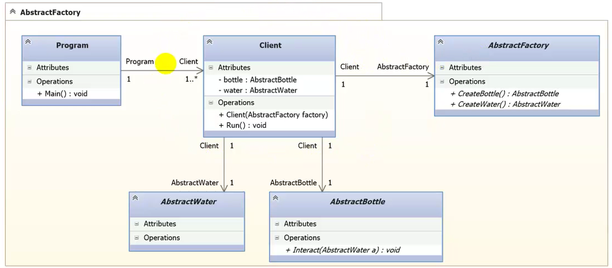
###Builder
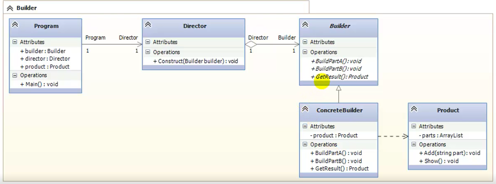
###Factory Method
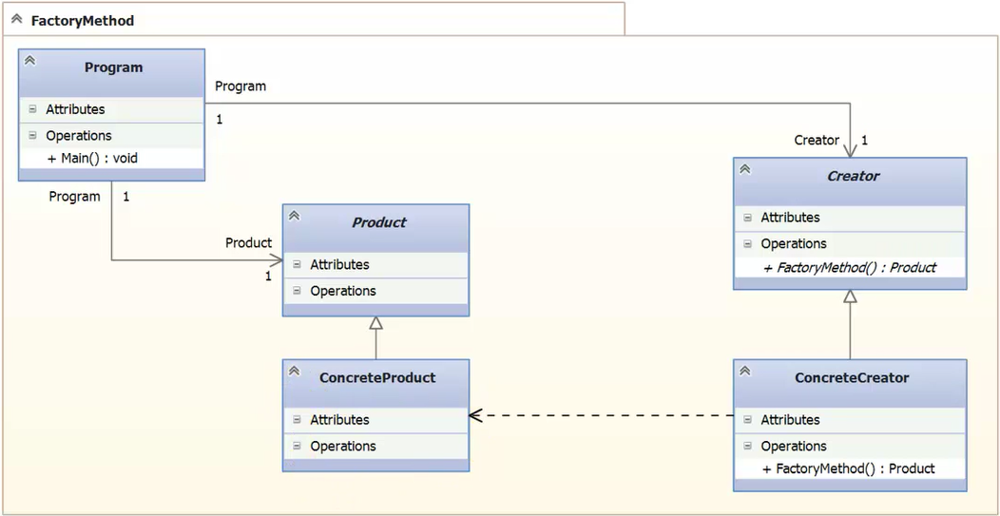
###Prototype
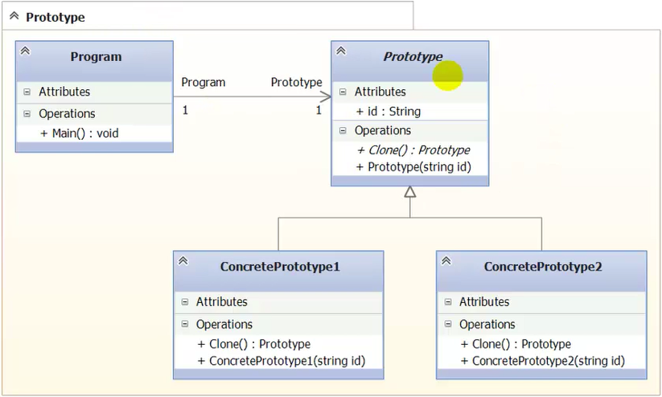
###Singleton
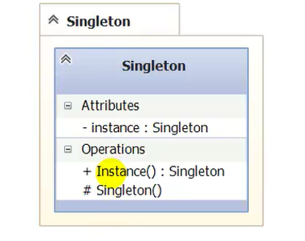
###Adapter
.PNG)
.PNG)
###Bridge
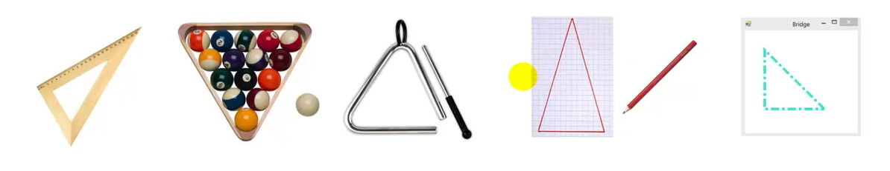
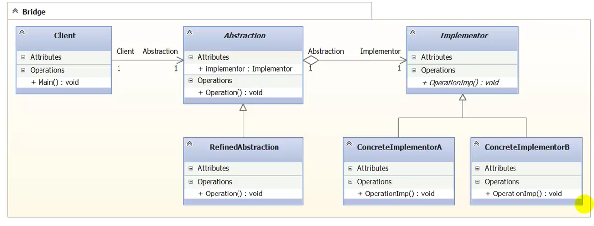
###Composite
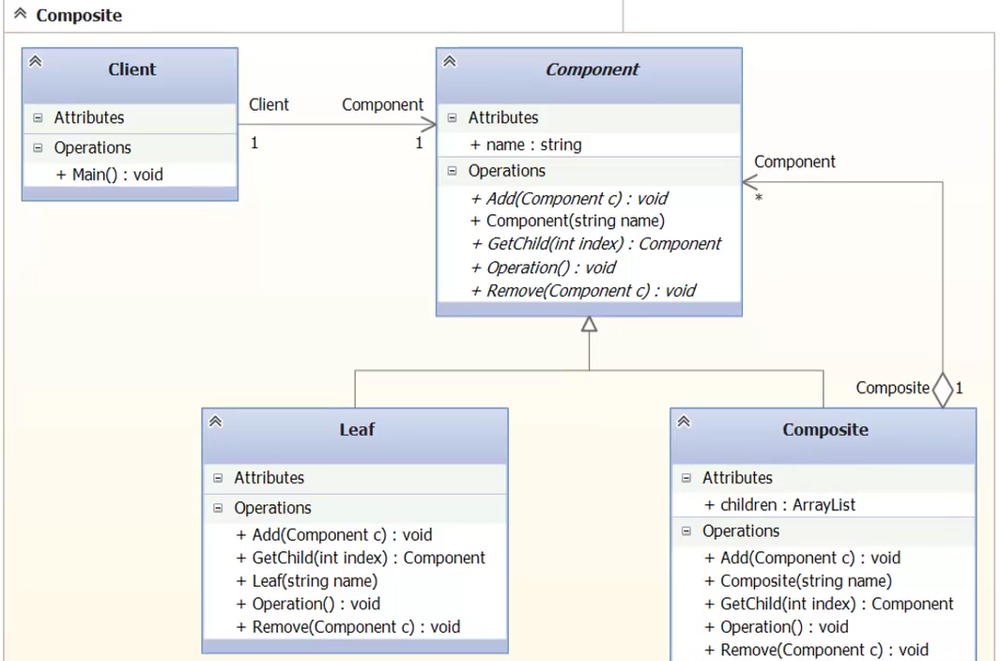
###Decorator
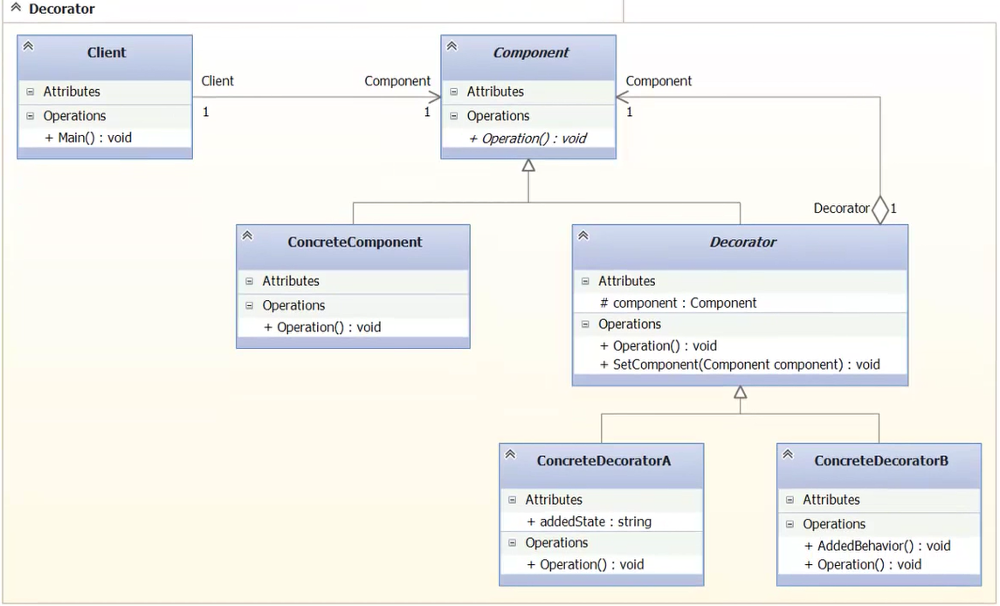
###Facade
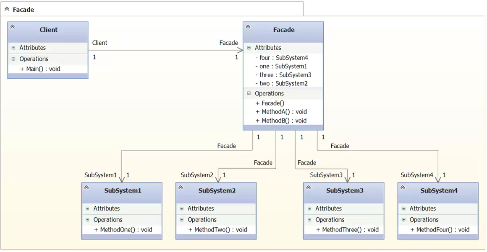
###Flyweight
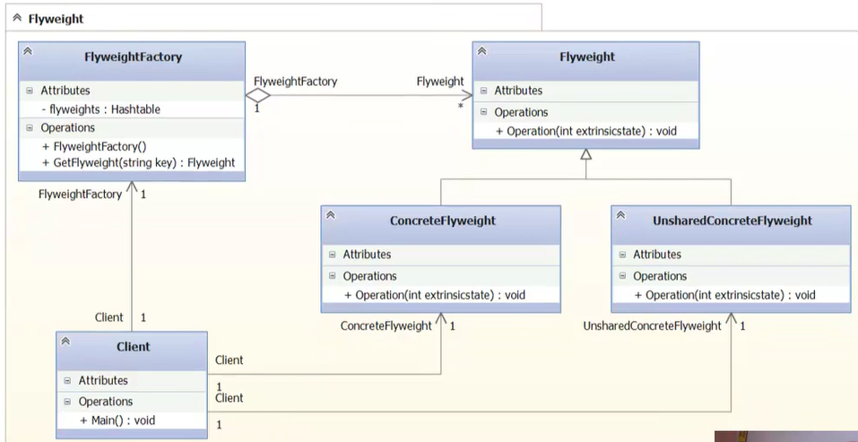
###Proxy
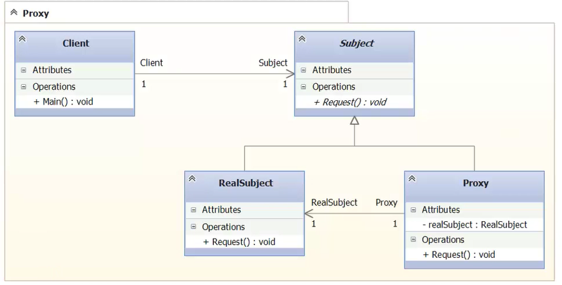
###Chain of Responsibility
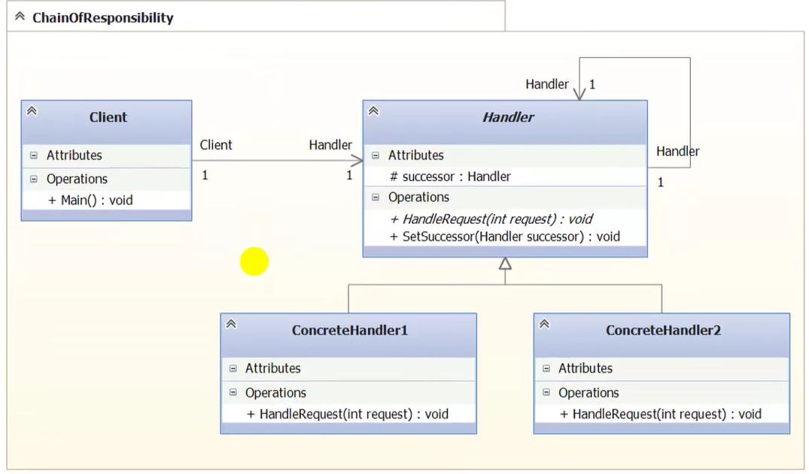

