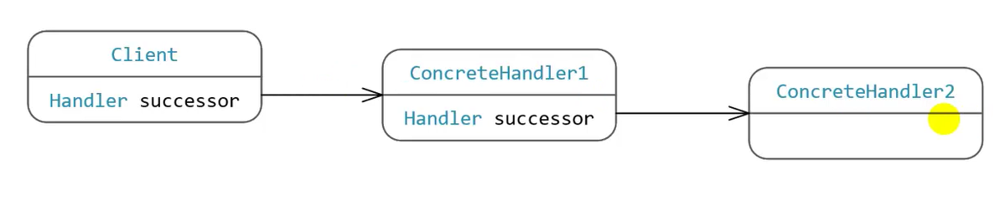
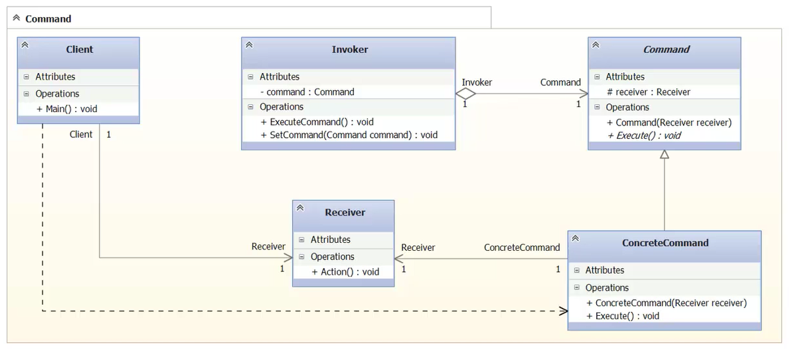
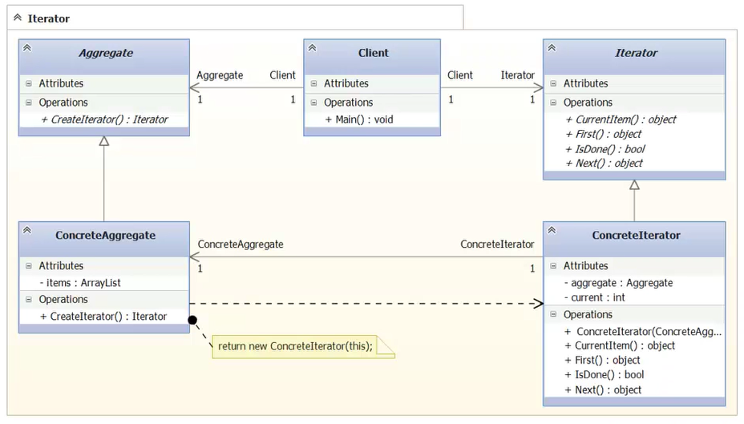
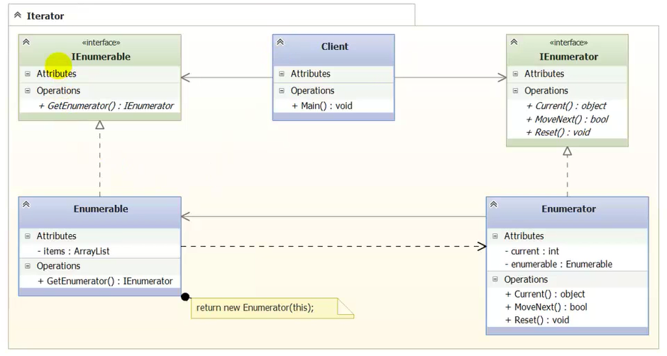
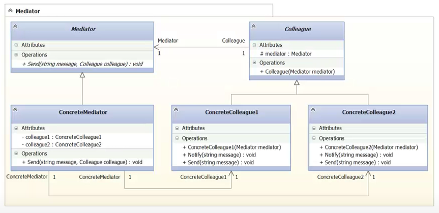
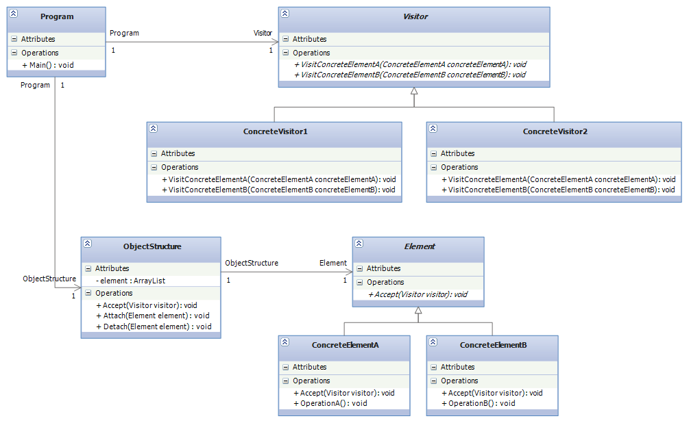

# Design-Patterns
Software Design Patterns.
---
### Abstract Factory

### Builder

### Factory Method

### Prototype

### Singleton

### Adapter
.PNG)
.PNG)
### Bridge

### Composite

### Decorator

### Facade

### Flyweight

### Proxy

### Chain of Responsibility

### Command

### Iterator

### Mediator

### Visitor

### SOA

